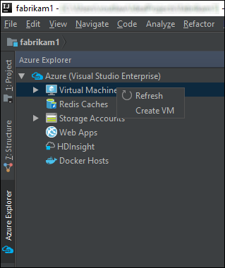

# Azure tools for Java developers

## Client and management libraries

Connect to services and manage Azure resources from your applications with the Azure libraries for Java. Import the management libraries into your Maven projects by adding this dependency to your project *pom.xml*.

```XML
<dependency>
    <groupId>com.microsoft.azure</groupId>
    <artifactId>azure</artifactId>
    <version>1.3.0</version>
</dependency>
```

View the [complete list of libraries](java-sdk-azure-install.md) and [get started](java-sdk-azure-get-started.md) with the Azure libraries for Java.

## Eclipse and IntelliJ plugins

Manage Azure resources and deploy apps from your IDE with The Azure toolkits for [Eclipse](eclipse/azure-toolkit-for-eclipse.md) and [IntelliJ](intellij/azure-toolkit-for-intellij.md).   



[Get started with Azure Toolkit for Eclipse](https://docs.microsoft.com/azure/app-service-web/app-service-web-eclipse-create-hello-world-web-app) | [Get started with Azure Toolkit for IntelliJ](https://docs.microsoft.com/azure/app-service-web/app-service-web-intellij-create-hello-world-web-app) 

## Azure CLI 2.0

The Azure 2.0 CLI provides a command-line experience to manage Azure resources. You can use it in your browser with [Azure Cloud Shell](https://docs.microsoft.com/azure/cloud-shell/overview), or you can [install](https://docs.microsoft.com/cli/azure/install-azure-cli) it on macOS, Linux, and Windows and run it from the command line.

[Get started with Azure CLI 2.0](https://docs.microsoft.com/cli/azure/get-started-with-azure-cli).

## Azure Storage Explorer 

Manage Azure storage accounts, containers, and blobs/files from your desktop. Azure Storage Explorer is currently in Preview and works on Windows, macOS, and Linux.

[Get started with Azure Storage Explorer](https://docs.microsoft.com/azure/vs-azure-tools-storage-manage-with-storage-explorer)