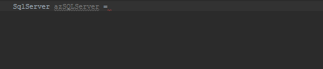

# Azure management library concepts

## Build resources through a fluent interface

A fluent interface is a specific form of the builder pattern that creates objects through a method chain that enforces correct configuration of a resource. For example, to create a new storage account

```java
StorageAccount storage = azure.storageAccounts().define(storageAccountName)
                  .withRegion(region)
                  .withNewResourceGroup(resourceGroup)
                  .create();
```

As you go through the method chain, your IDE suggests the next method to call in the fluent conversation.   



Chain the methods suggested by the IDE as long as they make sense for your resource-if you are missing a required method in the chain your IDE will highlight it with a compile error.

## Resource collections

The management library has a single point of entry through the top-level `com.microsoft.azure.management.Azure` object to create and update resources. Select which type of resources to work with using the resource collection methods defined in the `Azure` object. For example, SQL Database:

```java
SqlServer sqlServer = azure.sqlServers().define(sqlServerName)
                    .withRegion(Region.US_EAST)
                    .withNewResourceGroup(rgName)
                    .withAdministratorLogin(administratorLogin)
                    .withAdministratorPassword(administratorPassword)
                    .create();
```

## Lists and iterations

Each resource collection has a `list()` method to return every instance of that resource in your current subscription. For example, `azure.sqlServers().list()` returns all SQL databases in the subscription.

Use the `listByResourceGroup(String groupname)` method to scope the returned List to a specific [Azure resource group](https://docs.microsoft.com/azure/azure-resource-manager/resource-group-overview#resource-groups).  

Search and iterate over the returned `PagedList` collection just as you would a normal `List`:

```java
PagedList<VirtualMachine> vms = azure.virtualMachines().list();
for (VirtualMachine vm : vms) {
    System.out.println("Found virtual machine with ID " + vm.id());
}
```   

## Collections returned from queries

The management libraries follows a convention for returned collections from queries:

- Lists: Unordered data that is easy to search and interate over.
- Maps: Maps are key/value pairs with unique keys, but not necessarily unique values. An example of a Map would be app settings for a App Service webapp.
- Sets: Sets have unique keys and values. An example of a Set would be networks attached to a virtual machine, which would have both an unique identifier (the key) and a unique network configuration (the value).

## Actionable verbs

Methods with verbs in their names take immediate action in Azure. These methods work synchronously and block execution in the current thread until they complete. 

| Verb   |  Sample Usage |
|--------|---------------|
| create | `azure.virtualMachines().create(listOfVMCreatables)` |
| apply  | `virtualMachineScaleSet.update().withCapacity(6).apply()` |
| delete | `azure.disks().deleteById(id)` | 
| list   | `azure.sqlServers().list()` | 
| get    | `VirtualMachine vm  = azure.virtualMachines().getByResourceGroup(group, vmName)` |

>[!NOTE]
> `define()` and `update()` are verbs but do not block unless followed by a `create()` or `apply()`.
 
Asynchronous versions of these methods exist with a `Async` suffix use [Reactive extensions](https://github.com/ReactiveX/RxJava). 

Some objects have methods with that change the state of the resource in Azure. For example, `restart()` on a `VirtualMachine`:

```java
VirtualMachine vmToRestart = azure.getVirtualMachines().getById(id);
vmToRestart.restart();
```
These methods generally do not have asynchronous versions in the management libraries.

<a name="Creatables"></a>

## Lazy resource creation

A challenge when creating Azure resources arises when a new resource depends on another resource that doesn't yet exist. An example is reserving a public IP address and setting up a disk when creating a new virtual machine. You don't want to verify reserving the address or the creating the disk, you just want to ensure the virtual machine has those resources when it is created.

Use `Creatable<T>` objects to define Azure resources for use in your code but only create them when needed in Azure. Code written with `Creatable<T>` objects defers resource creation in the Azure environment to the management libraries, which create them only when they are needed and in parallel with other resources when possible.

Generate `Creatable<T>` objects through the resource collections' `define()` verb:

```java
Creatable<PublicIPAddress> publicIPAddressCreatable = azure.publicIPAddresses().define(publicIPAddressName)
                    .withRegion(Region.US_EAST)
                    .withNewResourceGroup(rgName);
```

The Azure resource defined by the `Creatable<PublicIPAddress>` in this example does not yet exist in your subscription when you run this code. The `Creatable<PublicIPAddress>` is a local representation of a resource that the management library will create when its needed. Use this `Creatable<PublicIPAddress>` to define other Azure resources with this IP address. 

```java
Creatable<VirtualMachine> vmCreatable = azure.virtualMachines().define("creatableVM")
        .withNewPrimaryPublicIPAddress(publicIPAddressCreatable)
```

Create the resources in your Azure subscription using the `create()` method for the resource collection. 

```java
CreatedResources<VirtualMachine> virtualMachine = azure.virtualMachines().create(vmCreatable);
```

Passing `Creatable<T>` to `create()` calls returns a `CreatedResources` object instead of a single resource object.  The `CreatedResources<T>` object lets you access all resources created by the `create()` call, not just the type from the resource collection. To access the public IP address created in Azure for the virtual machine created in the above example:

```java
PublicIPAddress pip = (PublicIPAddress) virtualMachine.createdRelatedResource(publicIPAddressCreatable.key());
```    

## Exception handling

The management API currently defines Exception classes that extend `com.microsoft.rest.RestException`. Catch exceptions generated by management API, with a `catch (RestException exception)` block after the relevant `try` statement.

## Logs and trace

Configure the amount of logging from the management API when you build the entry point `Azure` object using `withLogLevel()`. The following trace levels exist:

| Trace level | Logging enabled 
| ------------ | ---------------
| com.microsoft.rest.LogLevel.NONE | No output
| com.microsoft.rest.LogLevel.BASIC | Logs the URLs to underlying REST calls, response codes and times
| com.microsoft.rest.LogLevel.BODY | Everything in BASIC plus request and response bodies for the REST calls
| com.microsoft.rest.LogLevel.HEADERS | Everything in BASIC plus the request and response headers REST calls
| com.microsoft.rest.LogLevel.BODY_AND_HEADERS | Everything in both BODY and HEADERS log level

Bind a [SLF4J logging implementation](https://www.slf4j.org/manual.html) if you need to log output to a logging framework like [Log4J 2](https://logging.apache.org/log4j/2.x/).