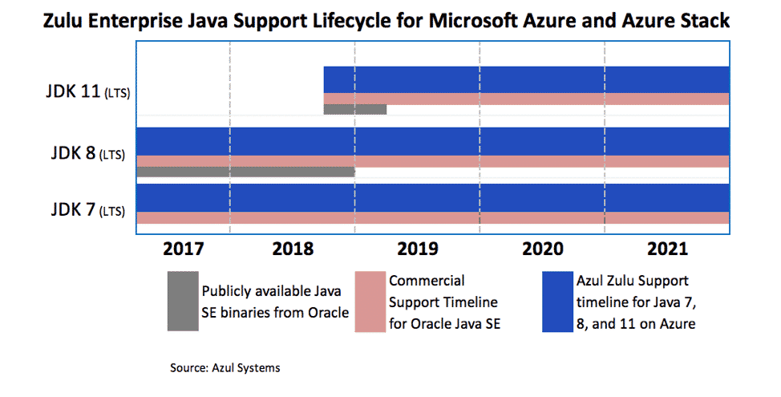

# Get Java JDK downloads and support when developing for Azure

Java developers on Azure and Azure Stack can build and run production Java applications using [Azul Systems Zulu Enterprise builds of OpenJDK](https://www.azul.com/downloads/azure-only/zulu/) without incurring additional support costs. You can use any Java runtime you want on Azure, but when you use Zulu you get free maintenance updates and can create support issues with Microsoft with a  [qualified Azure support plan](https://azure.microsoft.com/support/plans/).

## Supported Java versions and update schedule

Azul Systems will provide fully-supported [Zulu Enterprise builds of OpenJDK for Microsoft Azure](https://www.azul.com/downloads/azure-only/zulu/) for all long-term support (LTS) versions of Java, starting with Java SE 7, 8, and 11. More information can be found in the [Azul press release](https://www.azul.com/press_release/free-java-production-support-for-microsoft-azure-azure-stack).

These JDK releases will have quarterly security updates and bug fixes as well as critical out-of-band updates and patches as needed.  This support includes back porting of security updates and bug fixes to Java 7 and 8 reported in newer versions of Java such as Java 11, and ensures the continued stability and security of older versions of Java.  Azure customers are entitled to these security updates and platform bug fixes without incurring any unplanned Java SE subscription fees. The dates of support for each version of Java SE are highlighted in the image below.

Azul Systems maintains a [Java SE roadmap](https://www.azul.com/products/azul_support_roadmap/) for these releases.

## Use for Local development 

Developers can download Java JDKs for Azure and Azure Stack from [Azul Systems' website](https://www.azul.com/downloads/azure-only/zulu/). Downloads are available for Windows, Linux, and macOS. Developers working on Linux can also get packages through the  [yum](https://www.azul.com/downloads/azure-only/zulu/#yum-repo) and [apt](https://www.azul.com/downloads/azure-only/zulu/#apt-repo) package managers.

Product support for the Azure-supported Azul Zulu JDK is available through when developing for Azure or Azure Stack with a [qualified Azure support plan](https://azure.microsoft.com/support/plans/).

## Use in Docker containers

You can build unlimited Docker images using Zulu Enterprise builds of OpenJDK on any distros of your choice. Zulu Docker images based off the Azul Zulu Enterprise for Azure JDKs are available on [Microsoft's Container Registry](http://mcr.microsoft.com/). The entries to these images are also published to Docker Hub , and a complete list can be found on [Azul Systems' website](https://www.azul.com/downloads/azure-only/zulu/#docker).

Example Dockerfiles using the images are available in the [Microsoft Java GitHub repository](https://github.com/Microsoft/java/tree/master/docker).

## Azure service runtime support

Azure platform services such as [App Service](/azure/app-service/containers/), [Functions](/azure/azure-functions/functions-create-first-java-maven), [Service Fabric](/azure/service-fabric/) and [HDInsight](/azure/hdinsight/)  use Zulu Enterprise builds of OpenJDK with built-in auto-patching of minor releases of Java with security patches and bug fixes.