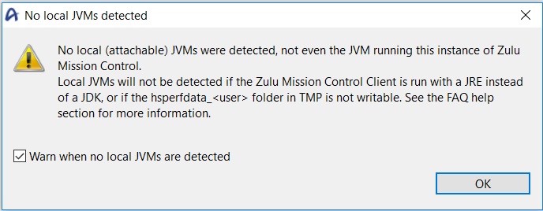
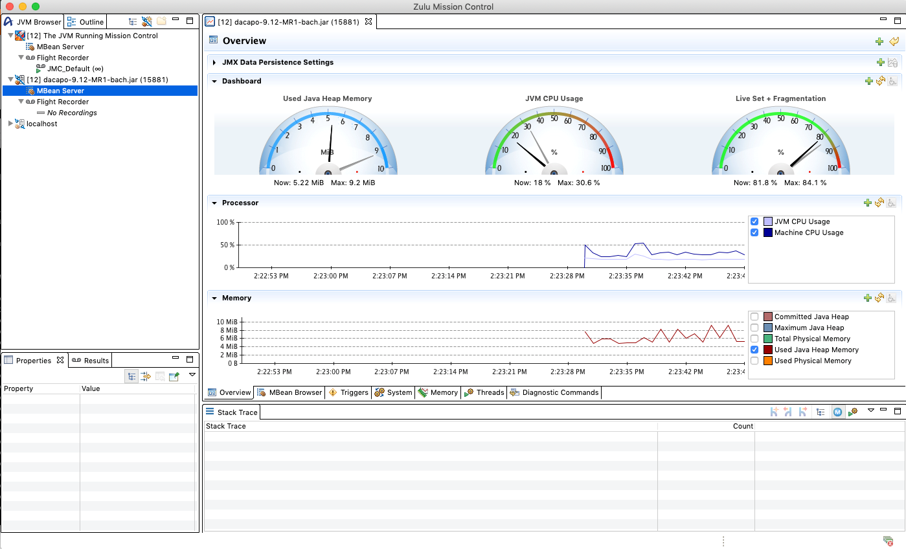
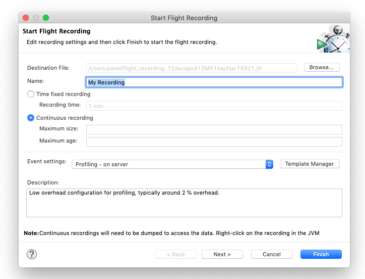
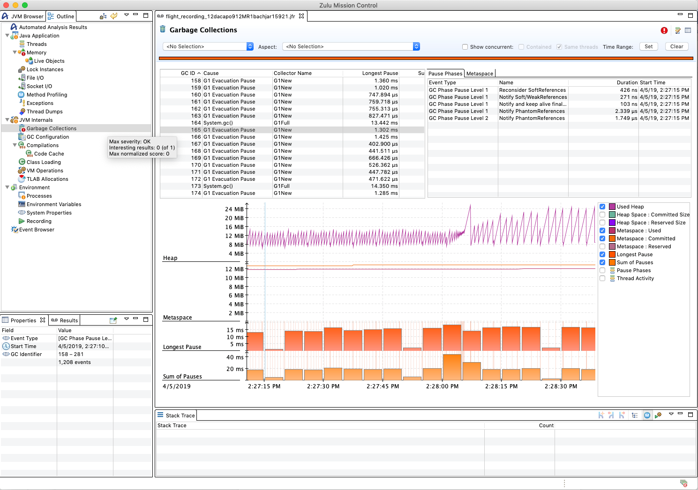

# Use Java Flight Recorder and Mission Control

Zulu Mission Control is a fully-tested build of JDK Mission Control, which was open-sourced by Oracle in 2018 and is managed as a project under the OpenJDK umbrella. Coupled with Java Flight Recorder (JFR), Mission Control delivers low-overhead, interactive monitoring and management capabilities for Java workloads.

Zulu Mission Control is compatible with the following Java Development Kits (JDKs) and Java Runtime Environments (JREs):

* Zulu 12.1 and later
* Zulu 11.0 and later
* Zulu 8u202 (8.36) and later
* Oracle OpenJDK 11 and 15 and later
* Oracle Java 11.0 and later
* Oracle Java 8.0 and later

## Install Zulu Mission Control and connect to a JVM

To install Zulu Mission Control, connect to a Java Virtual Machine (JVM), and gain real-time visibility into all aspects of a running application, do the following:

1.	[Install a Zulu Mission Control-compatible JDK and JRE](java-jdk-install.md).

1.	[Download Zulu Mission Control](https://www.azul.com/products/zulu-mission-control/), choose the appropriate version for your system, save it locally, and change to that directory.

1.	Expand the downloaded file.

    **Linux:**

    ```cli
    tar -xzvf zmc7.0.0-EA-linux_x64.tar.gz
    ```

    **Windows:**

    ```cli
    unzip -zxvf zmc7.0.0-EA-win_x64.zip	
    ```

    **macOS:**

    ```cli
    tar -xzvf zmc7.0.0-EA-macosx_x64.tar.gz
    ```

1.	Start your Java application by using one of the compatible JDKs. For example:

    ```cli
    $JAVA_HOME/bin/java -jar MyApplication.jar
    ```

1.	Start Zulu Mission Control.

    **Linux:**

    ```cli
    zmc7.0.0-EA-linux_x64/zmc
    ```

    **Windows:**

    ```cli
    zmc7.0.0-EA-win_x64\zmc.exe	
    ```

    **macOS:**

    ```cli
    zmc7.0.0-EA-macosx_x64/Zulu\ Mission\ Control.app/Contents/MacOS/zmc
    ```

1.	(Optional) Switch the JVM installation for Mission Control.

    On Windows devices, *zmc.exe* uses the default JVM installation that's configured in the registry. Zulu Mission Control must be launched from a full JDK to be able to detect local JVM instances automatically. If the installation is a JRE, no JVM will be detected, and you will receive the following warning:

    > [!div class="mx-imgBorder"]
    

    To change the JVM that's used by Mission Control, do the following: 

    a. Open the *zmc.ini* configuration file, which is in the same directory as the *zmc.exe* file.

    b. Before the line `-vmargs`, add two lines:  

       * On the first line, enter `–vm`.  
       * On the second line, enter the path to your JDK installation (for example, `C:\Program Files\Java\jdk1.8.0_212\bin\javaw.exe`).

1.	Locate the JVM that's running your application by doing the following:

    a. In the left pane of the Zulu Mission Control window, select the **JVM Browser** tab.

    b. In the list, select and expand the JVM instance that's running your application.

    


1.	Start a flight recording, if necessary.

    a. In the left pane, under **Flight Recorder**, if a *No Recordings* message is displayed, start a recording by right-clicking **Flight Recorder** and then selecting **Start Flight Recording**.

    b. Select either **Time fixed recording** or **Continuous recording**, and either a **Profiling** configuration (fine-grained) or a **Continuous** configuration (lower overhead), and then select **Finish**.

        

    A flight recording should appear below the **Flight Recorder** line in the JVM browser.

1. Dump the flight recording. To do so, right-click the line that represents the flight recording, and then select **Dump whole recording**.

    A new tab appears in the large pane on the right side of the Zulu Mission Control window. This pane represents the flight recording that was just dumped from the JVM that's running your application.

1. Examine the flight recording using Zulu Mission Control. To do so, select the **Outline** tab in the left pane of the Zulu Mission Control Window. This tab displays various views of the data that's collected in the flight recording.
 
    

## Resources

To learn more, go to the Azul Systems site and view [Azul Webinar: Open Source Flight Recorder and Mission Control - Managing and Measuring OpenJDK 8 Performance](https://www.azul.com/presentation/azul-webinar-open-source-flight-recorder-and-mission-control-managing-and-measuring-openjdk-8-performance/). The video is narrated by Azul Systems Deputy CTO Simon Ritter. The Flight Recorder discussion starts at 31:30.

