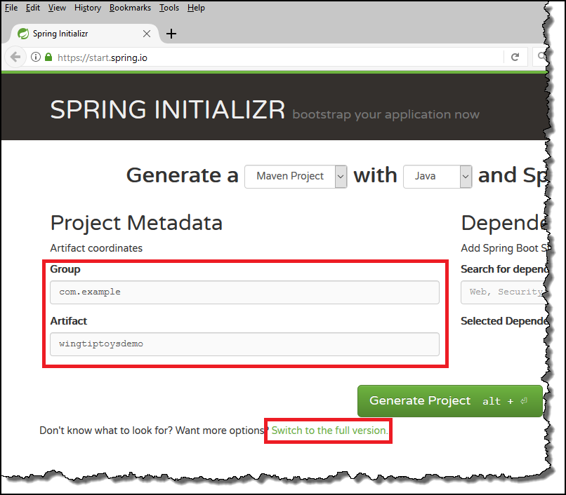
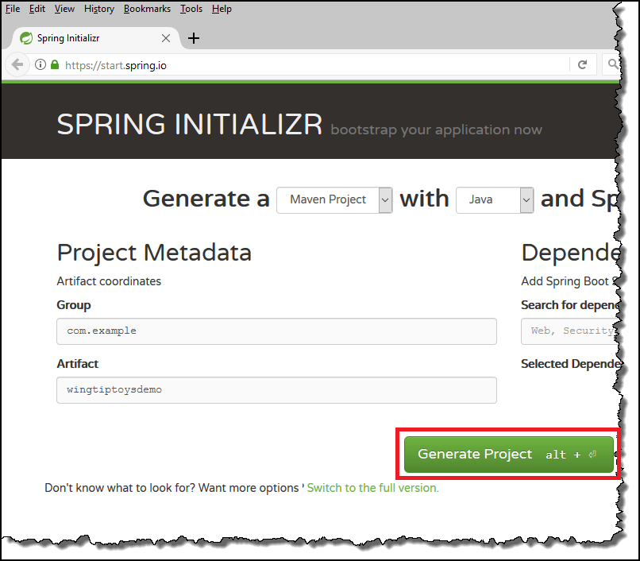
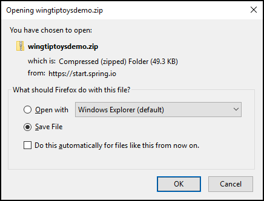

## What You'll Deploy to Azure

This article walks you through creating a custom application using the **Spring Initializr**, and then using that application to access Azure storage.

## What You'll Need

The following prerequisites are required in order to follow the steps in this article:

* An Azure subscription; if you don't already have an Azure subscription, you can activate your [MSDN subscriber benefits](https://azure.microsoft.com/pricing/member-offers/msdn-benefits-details/) or sign up for a [free Azure account](https://azure.microsoft.com/pricing/free-trial/).
* The [Azure Command-Line Interface (CLI)](http://docs.microsoft.com/cli/azure/overview).
* An up-to-date [Java Development Kit (JDK)](http://www.oracle.com/technetwork/java/javase/downloads/), version 1.7 or later.
* Apache's [Maven](http://maven.apache.org/), version 3.0 or later.

## Create a custom application using the Spring Initializr

1. Browse to <https://start.spring.io/>.

1. Specify that you want to generate a **Maven** project with **Java**, enter the **Group** and **Aritifact** names for your application, and then click the link to **Switch to the full version** of the Spring Initializr.

   

   **NOTE**: The Spring Initializr will use the **Group** and **Aritifact** names to create the package name; for example: *com.contoso.wingtiptoysdemo*.
   
1. Scroll down to the **Azure** section and check the boxes for **Azure Support** and **Azure Storage**.

   

1. Scroll to the bottom of the page and click the button to **Generate Project**.

   

1. When prompted, download the project to a path on your local computer.

   

## Sign into Azure and select the subscription to use

1. Open a command prompt.

1. Sign into your Azure account by using the Azure CLI:

   ```azurecli
   az login
   ```
   Follow the instructions to complete the sign-in process.

1. List your subscriptions:

   ```azurecli
   az account list
   ```
   Azure will return a list of your subscriptions, and you will need to copy the GUID for the subscription that you want to use; for example:

   ```json
   [
     {
       "cloudName": "AzureCloud",
       "id": "11111111-1111-1111-1111-111111111111",
       "isDefault": true,
       "name": "Converted Windows Azure MSDN - Visual Studio Ultimate",
       "state": "Enabled",
       "tenantId": "22222222-2222-2222-2222-222222222222",
       "user": {
         "name": "contoso@microsoft.com",
         "type": "user"
       }
     }
   ]

1. Specify the GUID for the account you want to use with Azure; for example:

   ```azurecli
   az account set -s 11111111-1111-1111-1111-111111111111
   ```

## Create an Azure Storage account

1. Create a resource group for the Azure resources you will use in this article; for example:
   ```azurecli
   az group create --name wingtiptoysresources --location westus
   ```
   Where:
   Parameter | Description
   ---|---|---
   `name` | Specifies a unique name for your resource group.
   `location` | Specifies the [Azure region](https://azure.microsoft.com/regions/) where your resource group will be hosted.

1. Create an Azure storage account in the in the resource group for your Spring Boot app; for example:
   ```azurecli
   az storage account create --name wingtiptoysstorage --resource-group wingtiptoysresources --location westus --sku Standard_LRS
   ```
   Where:
   Parameter | Description
   ---|---|---
   `name` | Specifies a unique name for your storage account.
   `resource-group` | Specifies the name of the resource group group you created in the previous step.
   `location` | Specifies the [Azure region](https://azure.microsoft.com/regions/) where your storage account will be hosted.
   `sku` | Specifies one of the following: `Premium_LRS`, `Standard_GRS`, `Standard_LRS`, `Standard_RAGRS`, `Standard_ZRS`.
   Azure will return a long JSON string which contains the provisioning state; for example:
   ```json
   {
     "id": "/subscriptions/11111111-1111-1111-1111-111111111111/...",
     "identity": null,
     "kind": "Storage"
     ...
     ...
     ...
     "statusOfPrimary": "available",
     "statusOfSecondary": null,
     "tags": {},
     "type": "Microsoft.Storage/storageAccounts"
   }
   ```

1. Retrieve the connection string for your storage account; for example:
   ```azurecli
   az storage account show-connection-string --name wingtiptoysstorage --resource-group wingtiptoysresources
   ```
   Where:
   Parameter | Description
   ---|---|---
   `name` | Specifies a unique name of the storage account you created in previous steps.
   `resource-group` | Specifies the name of the resource group you created in previous steps.
   Azure will return a JSON string which contains the connection string for your storage account; for example:
   ```json
   {
     "connectionString": "DefaultEndpointsProtocol=https;EndpointSuffix=core.windows.net;AccountName=wingtiptoysstorage;AccountKey=AbCdEfGhIjKlMnOpQrStUvWxYz=="
   }
   ```

## Configure and compile your Spring Boot application

1. Extract the files from the downloaded project archive into a directory.

1. Navigate to the *src/main/resources* folder in your project and open the *application.properties* file in a text editor.

1. Add the key for your storage account; for example:
   ```yaml
   azure.storage.connection-string=DefaultEndpointsProtocol=https;EndpointSuffix=core.windows.net;AccountName=wingtiptoysstorage;AccountKey=AbCdEfGhIjKlMnOpQrStUvWxYz==
   ```

1. Navigate to the */src/main/java/com/example/wingtiptoysdemo* folder in your project and open the *WingtiptoysdemoApplication.java* file in a text editor.

1. Replace the existing Java code with the following example that lists the blobs in a container:

   ```java
   package com.example.wingtiptoysdemo;

   import com.microsoft.azure.storage.*;
   import com.microsoft.azure.storage.blob.*;
   import org.springframework.beans.factory.annotation.Autowired;
   import org.springframework.boot.CommandLineRunner;
   import org.springframework.boot.SpringApplication;
   import org.springframework.boot.autoconfigure.SpringBootApplication;

   import java.net.URISyntaxException;

   @SpringBootApplication
   public class WingtiptoysdemoApplication implements CommandLineRunner {

       @Autowired
       private CloudStorageAccount cloudStorageAccount;

       final String containerName = "mycontainer";

       public static void main(String[] args) {
           SpringApplication.run(WingtiptoysdemoApplication.class, args);
       }

       public void run(String... var1)
               throws URISyntaxException, StorageException {
           // Create a container (if it does not exist).
           createContainerIfNotExists(containerName);
           // List the blobs in the container.
           listBlobInContainer(containerName);
       }

       private void createContainerIfNotExists(String containerName)
               throws URISyntaxException, StorageException {
           // Create a blob client.
           final CloudBlobClient blobClient = cloudStorageAccount.createCloudBlobClient();
           // Get a reference to a container. (Name must be lower case.)
           final CloudBlobContainer container = blobClient.getContainerReference(containerName);
           // Create the container if it does not exist.
           container.createIfNotExists();
       }

       private void listBlobInContainer(String containerName)
               throws StorageException, URISyntaxException {
           // Create a blob client.
           final CloudBlobClient blobClient = cloudStorageAccount.createCloudBlobClient();
           // Retrieve a reference to a previously-created container.
           final CloudBlobContainer container = blobClient.getContainerReference(containerName);
           // Loop through blobs within the container and output the URI to each of them.
           for (final ListBlobItem blobItem : container.listBlobs()) {
               System.out.println(blobItem.getUri());
           }
       }
   }
   ```

   **NOTE**: The above example autowires the storage account settings that you defined in the *application.properties* file.

1. Compile and run the application:
   ```shell
   mvn clean package spring-boot:run
   ```
   The URLs for any blobs in the container will be listed to the screen. At the very least, the container itself should be listed; for example:
   ```
   https://wingtiptoysstorage.blob.core.windows.net/mycontainer//
   ```

### Troubleshooting Notes

When you compile your application, you might see the following error message:

```
[INFO] ------------------------------------------------------------------------
[INFO] BUILD FAILURE
[INFO] ------------------------------------------------------------------------
[INFO] Total time: 2.616 s
[INFO] Finished at: 2017-11-11T13:14:15Z
[INFO] Final Memory: 26M/213M
[INFO] ------------------------------------------------------------------------
[ERROR] Failed to execute goal org.apache.maven.plugins:maven-surefire-plugin:2
.18.1:test (default-test) on project wingtiptoysdemo: Execution default-test of
goal org.apache.maven.plugins:maven-surefire-plugin:2.18.1:test failed: The for
ked VM terminated without properly saying goodbye. VM crash or System.exit called?
[ERROR] Command was /bin/sh -c cd /home/robert/SpringBoot/wingtiptoysdemo && /u
sr/lib/jvm/java-8-openjdk-amd64/jre/bin/java -jar /home/robert/SpringBoot/wingt
iptoysdemo/target/surefire/surefirebooter6371623993063346766.jar /home/robert/S
pringBoot/wingtiptoysdemo/target/surefire/surefire5107893623933537917tmp /home/
robert/SpringBoot/wingtiptoysdemo/target/surefire/surefire_01414159391084128068tmp
[ERROR] -> [Help 1]
```

If this happens, you might want to disable the Maven Surefire testing; to do so, add the following plugin entry in your *pom.xml* file:

```xml
<plugin>
  <groupId>org.apache.maven.plugins</groupId>
  <artifactId>maven-surefire-plugin</artifactId>
  <version>2.20.1</version>
  <configuration>
    <skipTests>true</skipTests>
  </configuration>
</plugin>
```

## Summary

In this tutorial you learned how to create a custom application using the **Spring Initializr**, and then to use that application to access Azure storage.

## More information

For more information about additional Azure storage APIs which you can call from your Spring Boot applications, see the following articles:

| Storage Type | Reference Link |
|---|---|
| Blob Storage | https://docs.microsoft.com/azure/storage/blobs/storage-java-how-to-use-blob-storage |
| Queue Storage | https://docs.microsoft.com/azure/storage/queues/storage-java-how-to-use-queue-storage |
| Table Storage | https://docs.microsoft.com/azure/cosmos-db/table-storage-how-to-use-java |
| File Storage | https://docs.microsoft.com/azure/storage/files/storage-java-how-to-use-file-storage |
