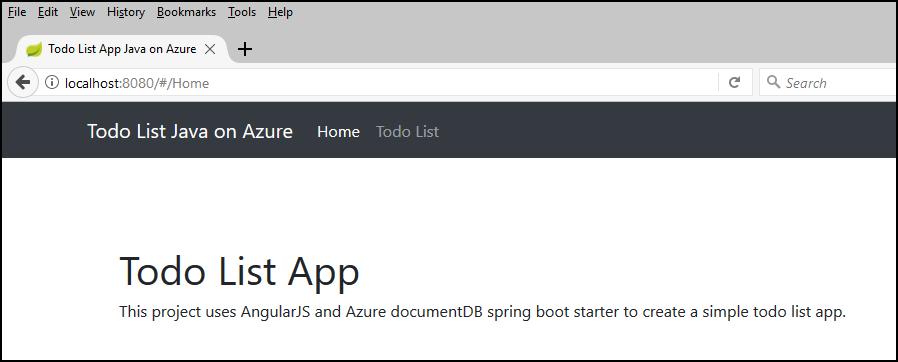
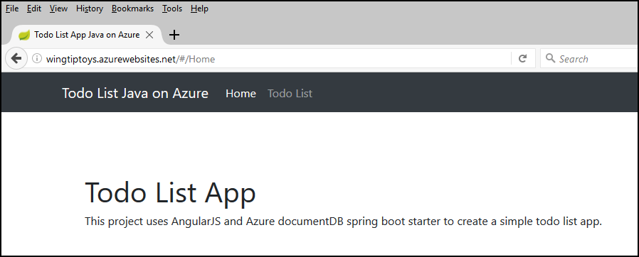

This article will show you how to clone a sample Spring Boot application that uses Cosmos DB for data and deploy it to Azure using Maven.

## What You'll Deploy to Azure

When you complete the steps in this tutorial you will have a simple todo list running in Azure.


## What You'll Need

In order to complete the steps in this tutorial, you need to have the following prerequisites:

* An Azure subscription; if you don't already have an Azure subscription, you can activate your [MSDN subscriber benefits] or sign up for a [free Azure account].
* The [Azure Command-Line Interface (CLI)].
* An up-to-date [Java Development Kit (JDK)], version 1.7 or later.
* Apache's [Maven] build tool (Version 3).
* A [Git] client.
* A [Docker] client.

In order to complete the steps in this tutorial, you need to have the following prerequisites:

* An Azure subscription; if you don't already have an Azure subscription, you can activate your [MSDN subscriber benefits](https://azure.microsoft.com/pricing/member-offers/msdn-benefits-details/) or sign up for a [free Azure account](https://azure.microsoft.com/pricing/free-trial/).
* The [Azure Command-Line Interface (CLI)](http://docs.microsoft.com/cli/azure/overview).
* An up-to-date [Java Development Kit (JDK)](http://www.oracle.com/technetwork/java/javase/downloads/), version 1.7 or later.
* Apache's [Maven](http://maven.apache.org/) build tool (Version 3).
* A [Git](https://github.com/) client.
* A [Docker](https://www.docker.com/) client.

## Sign into Azure and select the subscription to use

1. Open a command prompt.

1. Sign into your Azure account by using the Azure CLI:

   ```azurecli
   az login
   ```
   Follow the instructions to complete the sign-in process.

1. List your subscriptions:

   ```azurecli
   az account list
   ```
   Azure will return a list of your subscriptions, and you will need to copy the GUID for the subscription that you want to use; for example:

   ```json
   [
     {
       "cloudName": "AzureCloud",
       "id": "11111111-1111-1111-1111-111111111111",
       "isDefault": true,
       "name": "Converted Windows Azure MSDN - Visual Studio Ultimate",
       "state": "Enabled",
       "tenantId": "22222222-2222-2222-2222-222222222222",
       "user": {
         "name": "contoso@microsoft.com",
         "type": "user"
       }
     }
   ]

1. Specify the GUID for the account you want to use with Azure; for example:

   ```azurecli
   az account set -s 11111111-1111-1111-1111-111111111111
   ```

## Create an Azure container registry

1. Create a resource group for the Azure resources you will use in this article; for example:
   ```azurecli
   az group create --name=wingtiptoysresources --location=westus
   ```
   Where:
   Parameter | Description
   ---|---|---
   `name` | Specifies a unique name for your resource group.
   `location` | Specifies the [Azure region](https://azure.microsoft.com/regions/) where your resource group will be hosted.

1. Create a private Azure container registry in the resource group for your Spring Boot app; for example:
   ```azurecli
   az acr create --admin-enabled --resource-group wingtiptoysresources --location westus --name wingtiptoysregistry --sku Basic
   ```
   Where:
   Parameter | Description
   ---|---|---
   `resource-group` | Specifies the name of the resource group you created in the previous step.
   `name` | Specifies a unique name for your container registry.
   `location` | Specifies the [Azure region](https://azure.microsoft.com/regions/) where your container registry will be hosted.
   `sku` | Specifies one of the following: `Classic`, `Basic`, `Standard`, `Premium`.

1. Retrieve the password for the container registry you just created; for example:
   ```azurecli
   az acr credential show --name wingtiptoysregistry --query passwords[0]
   ```
   Azure will respond with your password; for example:
   ```json
   {
      "name": "password",
      "value": "AbCdEfGhIjKlMnOpQrStUvWxYz"
   }
   ```

## Create a Cosmos DB documentDB

1. Create a new Cosmos DB in the resource group you created in the previous section; for example:

   ```azurecli
   az cosmosdb create --kind GlobalDocumentDB --resource-group wingtiptoysresources --name wingtiptoysdata
   ```
   Where:
   Parameter | Description
   ---|---|---
   `GlobalDocumentDB` | Specifies that you want to use DocumentDB.
   `resource-group` | Specifies the name of the resource group you created earlier.
   `name` | Specifies a unique name for your Cosmos DB.
   Azure will respond with a status message that contains the `documentEndpoint` which you will use later:
   ```json
   {
     "consistencyPolicy": {
       "defaultConsistencyLevel": "Session",
       "maxIntervalInSeconds": 5,
       "maxStalenessPrefix": 100
     },
     "databaseAccountOfferType": "Standard",
     "documentEndpoint": "https://wingtiptoysdata.documents.azure.com:443/",
     "enableAutomaticFailover": false,
     "failoverPolicies": [
          {
         "failoverPriority": 0,
         "id": "wingtiptoysdata-westus",
         "locationName": "West US"
       }
     ],
     ...
     ...
     ...
   }
   ```

1. Retrieve the key for the Cosmos DB you just created; for example:

   ```azurecli
   az cosmosdb list-keys --resource-group wingtiptoysresources --name wingtiptoysdata
   ```
   Where:
   Parameter | Description
   ---|---|---
   `resource-group` | Specifies the name of the resource group.
   `name` | Specifies the name for your Cosmos DB you just created.
   Azure will respond with a status message that contains the keys which you will use later:
   ```json
   {
     "primaryMasterKey": "AbCdEfGhIjKlMnOpQrStUvWxYz==",
     "primaryReadonlyMasterKey": "AbCdEfGhIjKlMnOpQrStUvWxYz==",
     "secondaryMasterKey": "AbCdEfGhIjKlMnOpQrStUvWxYz==",
     "secondaryReadonlyMasterKey": "AbCdEfGhIjKlMnOpQrStUvWxYz=="
   }
   ```

## Configure Maven to use your container registry

1. Open your Maven *settings.xml* file in a text editor; this file might be in a path like the following examples:

   - `/etc/maven/settings.xml`
   - `%ProgramFiles%\apache-maven\3.5.0\conf\settings.xml`
   - `$HOME/.m2/settings.xml`

1. Add your Azure Container Registry access settings from the previous section of this article to the `<servers>` collection in the *settings.xml* file; for example:

   ```xml
   <servers>
     <server>
       <id>wingtiptoysregistry.azurecr.io</id>
       <username>wingtiptoysregistry</username>
       <password>AbCdEfGhIjKlMnOpQrStUvWxYz</password>
       <configuration>
         <email>contoso@microsoft.com</email>
       </configuration>
     </server>
   </servers>
   ```
   Where:
   Element | Description
   ---|---|---
   `<id>` | Specifies the URL of your private Azure container registry, which is derived by appending ".azurecr.io" to the name of your private container registry.
   `<username>` | Specifies the name of your private Azure container registry.
   `<password>` | Specifies the password you retrieved the previous steps of this article.

1. Save and close the *settings.xml* file. 

## Clone and configure the TODO sample application

1. Open a command prompt or terminal window and create a local directory to hold your Spring Boot application, and change to that directory; for example:
   ```shell
   md C:\SpringBoot
   cd C:\SpringBoot
   ```
   -- or --
   ```shell
   mkdir /home/robert/SpringBoot
   cd /home/robert/SpringBoot
   ```

1. Clone the [Spring Boot on Docker Getting Started] sample project into the directory you created; for example:
   ```shell
   git clone https://github.com/Microsoft/todo-app-java-on-azure/
   ```

1. Navigate to the project directory for the sample Spring Boot application, (e.g. "*C:\SpringBoot\todo-app-java-on-azure*" or "*/home/robert/SpringBoot/todo-app-java-on-azure*")

1. Open the *pom.xml* file with a text editor. 

1. Update the `<properties>` collection in the *pom.xml* file with the login server value for your Azure Container Registry from the previous section of this tutorial; for example:

   ```xml
   <properties>
      ...
      <docker.image.prefix>wingtiptoysregistry.azurecr.io</docker.image.prefix>
      <azure.app.name>todo-app-${maven.build.timestamp}</azure.app.name>
      ...
   </properties>
   ```
   Where:
   Element | Description
   ---|---|---
   `<docker.image.prefix>` | Specifies the URL of your private Azure container registry, which is derived by appending ".azurecr.io" to the name of your private container registry.
   `<azure.app.name>` | Specifies an optional name for your web app, which in this example uses the build timestamp differentiate between app versions.

1. Save and close the *pom.xml* file. 

1. Navigate to the directory that contains the project's *application.properties* file,  (e.g. "*C:\SpringBoot\todo-app-java-on-azure\src\main\resources*" or "*/home/robert/SpringBoot/todo-app-java-on-azure/src/main/resources*")

1. Open the *application.properties* file with a text editor. 

1. Update the properties with the appropriate values for your Cosmos DB from previous steps; for example:
   ```yaml
   azure.documentdb.uri=https://wingtiptoysdata.documents.azure.com:443/
   azure.documentdb.key=AbCdEfGhIjKlMnOpQrStUvWxYz==
   azure.documentdb.database=wingtiptoysdata
   ```
   Where:
   Property | Description
   ---|---|---
   `azure.documentdb.uri` | Specifies the URL of your Cosmos DB, which is derived by appending ".documents.azure.com:443" to the name of your private container registry.
   `azure.documentdb.key | Specifies the key for your Cosmos DB (which you retrieved in earlier steps).
   `azure.documentdb.database` | Specifies the name for your Cosmos DB.

1. Save and close the *application.properties* file. 

## Test the TODO sample application locally

1. Navigate to the root directory of the project and build the JAR file using Maven; for example:
   ```shell
   mvn clean package
   ```

1. When the web app has been built, start the web app using Maven; for example:
   ```shell
   mvn spring-boot:run
   ```

1. Test the web app by browsing to http://localhost:8080 using a web browser; you should see the home page for the sample app displayed.

   

## Build the Docker image and deploy it to Azure

1. Rebuild the sample project and create a docker container image, then push the image to your Azure container registry.

   ```shell
   mvn clean package docker:build docker:push
   ```

1. Deploy your docker container image from your Registry to Azure Web App for Containers.

   ```shell
   mvn azure-webapp:deploy
   ```

## Test the TODO sample application remotely

1. Browse to your web app's URL using a web browser; you should see same the home page for the sample app displayed.

   

1. If you click on the **Todo List** link, you can Add/Edit/Remove entries from the todo list.

   

## OPTIONAL: Remove your resources from your Azure account

You can delete the resource group that contains all of resources which were created in this tutorial by using the Azure CLI:

   ```azurecli
   az group delete -y --no-wait --name wingtiptoysresources
   ```

## Summary

In this tutorial you learned how to clone a sample Spring Boot application that uses Cosmos DB for data and deploy it to Azure using Maven.
