This article will show you how to clone a sample Spring Boot application that uses Cosmos DB for data and deploy it to Azure using IntelliJ.

## What You'll Deploy to Azure

When you complete the steps in this tutorial you will have a simple todo list running in Azure.


## What You'll Need

In order to complete the steps in this tutorial, you need to have the following prerequisites:

* [IntelliJ IDEA Ultimate or Community](https://www.jetbrains.com/idea/)
* An Azure subscription; if you don't already have an Azure subscription, you can activate your [MSDN subscriber benefits](https://azure.microsoft.com/pricing/member-offers/msdn-benefits-details/) or sign up for a [free Azure account](https://azure.microsoft.com/pricing/free-trial/).
* The [Azure Command-Line Interface (CLI)](http://docs.microsoft.com/cli/azure/overview).
* An up-to-date [Java Development Kit (JDK)](http://www.oracle.com/technetwork/java/javase/downloads/), version 1.7 or later.
* Apache's [Maven](http://maven.apache.org/) build tool (Version 3).
* A [Git](https://github.com/) client.
* A [Docker](https://www.docker.com/) client.

## Sign into Azure and select the subscription to use

1. Open a command prompt.

1. Sign into your Azure account by using the Azure CLI:

   ```azurecli
   az login
   ```
   Follow the instructions to complete the sign-in process.

1. List your subscriptions:

   ```azurecli
   az account list
   ```
   Azure will return a list of your subscriptions, and you will need to copy the GUID for the subscription that you want to use; for example:

   ```json
   [
     {
       "cloudName": "AzureCloud",
       "id": "11111111-1111-1111-1111-111111111111",
       "isDefault": true,
       "name": "Converted Windows Azure MSDN - Visual Studio Ultimate",
       "state": "Enabled",
       "tenantId": "22222222-2222-2222-2222-222222222222",
       "user": {
         "name": "contoso@microsoft.com",
         "type": "user"
       }
     }
   ]

1. Specify the GUID for the account you want to use with Azure; for example:

   ```azurecli
   az account set -s 11111111-1111-1111-1111-111111111111
   ```

## Create an Azure container registry

1. Create a resource group for the Azure resources you will use in this article; for example:
   ```azurecli
   az group create --name=wingtiptoysresources --location=westus
   ```
   Where:
   Parameter | Description
   ---|---|---
   `name` | Specifies a unique name for your resource group.
   `location` | Specifies the [Azure region](https://azure.microsoft.com/regions/) where your resource group will be hosted.

1. Create a private Azure container registry in the resource group for your Spring Boot app; for example:
   ```azurecli
   az acr create --admin-enabled --resource-group wingtiptoysresources --location westus --name wingtiptoysregistry --sku Basic
   ```
   Where:
   Parameter | Description
   ---|---|---
   `resource-group` | Specifies the name of the resource group you created in the previous step.
   `name` | Specifies a unique name for your container registry.
   `location` | Specifies the [Azure region](https://azure.microsoft.com/regions/) where your container registry will be hosted.
   `sku` | Specifies one of the following: `Classic`, `Basic`, `Standard`, `Premium`.

1. Retrieve the password for the container registry you just created; for example:
   ```azurecli
   az acr credential show --name wingtiptoysregistry --query passwords[0]
   ```
   Azure will respond with your password; for example:
   ```json
   {
      "name": "password",
      "value": "AbCdEfGhIjKlMnOpQrStUvWxYz"
   }
   ```

## Create a Cosmos DB documentDB

1. Create a new Cosmos DB in the resource group you created in the previous section; for example:

   ```azurecli
   az cosmosdb create --kind GlobalDocumentDB --resource-group wingtiptoysresources --name wingtiptoysdata
   ```
   Where:
   Parameter | Description
   ---|---|---
   `GlobalDocumentDB` | Specifies that you want to use DocumentDB.
   `resource-group` | Specifies the name of the resource group you created earlier.
   `name` | Specifies a unique name for your Cosmos DB.
   Azure will respond with a status message that contains the `documentEndpoint` which you will use later:
   ```json
   {
     "consistencyPolicy": {
       "defaultConsistencyLevel": "Session",
       "maxIntervalInSeconds": 5,
       "maxStalenessPrefix": 100
     },
     "databaseAccountOfferType": "Standard",
     "documentEndpoint": "https://wingtiptoysdata.documents.azure.com:443/",
     "enableAutomaticFailover": false,
     "failoverPolicies": [
          {
         "failoverPriority": 0,
         "id": "wingtiptoysdata-westus",
         "locationName": "West US"
       }
     ],
     ...
     ...
     ...
   }
   ```

1. Retrieve the key for the Cosmos DB you just created; for example:

   ```azurecli
   az cosmosdb list-keys --resource-group wingtiptoysresources --name wingtiptoysdata
   ```
   Where:
   Parameter | Description
   ---|---|---
   `resource-group` | Specifies the name of the resource group.
   `name` | Specifies the name for your Cosmos DB you just created.
   Azure will respond with a status message that contains the keys which you will use later:
   ```json
   {
     "primaryMasterKey": "AbCdEfGhIjKlMnOpQrStUvWxYz==",
     "primaryReadonlyMasterKey": "AbCdEfGhIjKlMnOpQrStUvWxYz==",
     "secondaryMasterKey": "AbCdEfGhIjKlMnOpQrStUvWxYz==",
     "secondaryReadonlyMasterKey": "AbCdEfGhIjKlMnOpQrStUvWxYz=="
   }
   ```

## Configure Maven to use your container registry

1. Open your Maven *settings.xml* file in a text editor; this file might be in a path like the following examples:

   - `/etc/maven/settings.xml`
   - `%ProgramFiles%\apache-maven\3.5.0\conf\settings.xml`
   - `$HOME/.m2/settings.xml`

1. Add your Azure Container Registry access settings from the previous section of this article to the `<servers>` collection in the *settings.xml* file; for example:

   ```xml
   <servers>
     <server>
       <id>wingtiptoysregistry.azurecr.io</id>
       <username>wingtiptoysregistry</username>
       <password>AbCdEfGhIjKlMnOpQrStUvWxYz</password>
       <configuration>
         <email>contoso@microsoft.com</email>
       </configuration>
     </server>
   </servers>
   ```
   Where:
   Element | Description
   ---|---|---
   `<id>` | Specifies the URL of your private Azure container registry, which is derived by appending ".azurecr.io" to the name of your private container registry.
   `<username>` | Specifies the name of your private Azure container registry.
   `<password>` | Specifies the password you retrieved the previous steps of this article.

1. Save and close the *settings.xml* file. 

## Clone the TODO sample application

1. Start IntelliJ, and sign into your Azure account by using the instructions in the [Azure Sign In Instructions for the Azure Toolkit for IntelliJ](https://docs.microsoft.com/java/azure/intellij/azure-toolkit-for-intellij-sign-in-instructions) article.

1. Click **File**, then **New**, then **Project from Version Control**, and then **GitHub**.

   

1. Specify <https://github.com/Microsoft/todo-app-java-on-azure/> for the repository URL, specify your destination directories, and then click **Clone**.

   

1. Answer **Yes** when prompted to create a project.

   

1. Choose to **Create project from existing sources**, and then click **Next**.

   

1. Specify the location where you cloned the repository, and then click **Next**.

   

1. Verify that the source files from the repository are selected, and then click **Next**.

   

1. Click **Next** when prompted for libraries.

   

1. Click **Next** when prompted for dependencies.

   

1. Specify your JDK, and then click **Next**.

   

1. Click **Finish** to being the import.

   

## Configure the TODO sample application

1. Open the *pom.xml* file, and update the `<properties>` collection with the login server value for your Azure Container Registry from the earlier section of this tutorial; for example:

   ```xml
   <properties>
      ...
      <docker.image.prefix>wingtiptoysregistry.azurecr.io</docker.image.prefix>
      <azure.app.name>todo-app-${maven.build.timestamp}</azure.app.name>
      ...
   </properties>
   ```
   Where:
   Element | Description
   ---|---|---
   `<docker.image.prefix>` | Specifies the URL of your private Azure container registry, which is derived by appending ".azurecr.io" to the name of your private container registry.
   `<azure.app.name>` | Specifies an optional name for your web app, which in this example uses the build timestamp differentiate between app versions.

   

1. Save and close the *pom.xml* file. 

1. Navigate to the directory that contains the project's *application.properties* file,  (e.g. "*C:\SpringBoot\todo-app-java-on-azure\src\main\resources*" or "*/home/robert/SpringBoot/todo-app-java-on-azure/src/main/resources*")

1. Open the *application.properties* file with a text editor. 

1. Update the properties with the appropriate values for your Cosmos DB from previous steps; for example:
   ```yaml
   azure.documentdb.uri=https://wingtiptoysdata.documents.azure.com:443/
   azure.documentdb.key=AbCdEfGhIjKlMnOpQrStUvWxYz==
   azure.documentdb.database=wingtiptoysdata
   ```
   Where:
   Property | Description
   ---|---|---
   `azure.documentdb.uri` | Specifies the URL of your Cosmos DB, which is derived by appending ".documents.azure.com:443" to the name of your private container registry.
   `azure.documentdb.key | Specifies the key for your Cosmos DB (which you retrieved in earlier steps).
   `azure.documentdb.database` | Specifies the name for your Cosmos DB.

   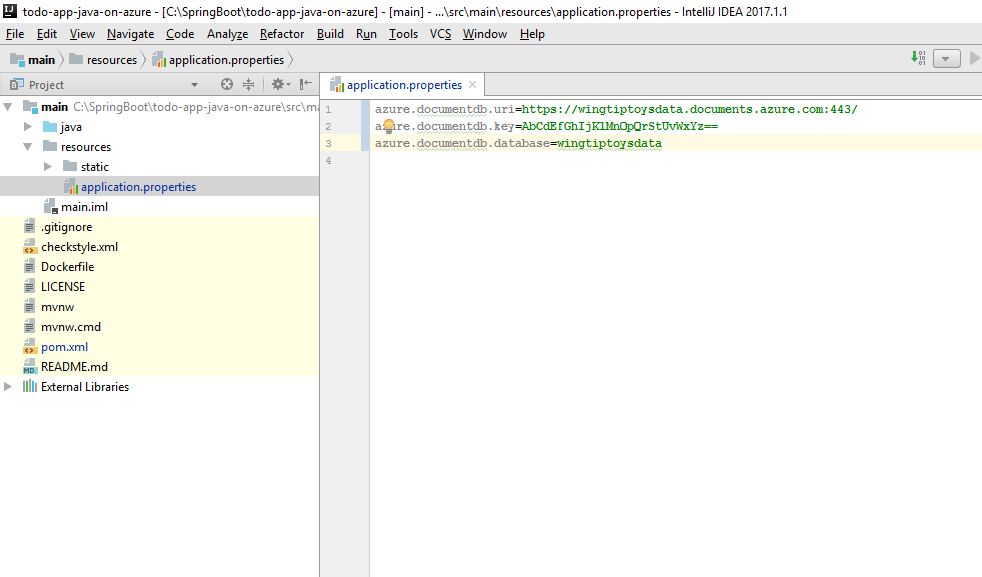

1. Save and close the *application.properties* file. 


## Create a deployment-ready artifact

To publish your Spring Boot app, you need to create a deployment-ready artifact. Use the following steps:

1. Click **File**, and then click **Project Structure**.

   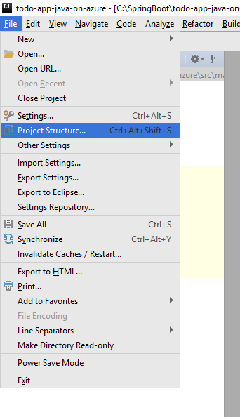

1. When the **Project Structure** dialog box opens, click **Artifacts**, click the green plus (**+**) symbol to add an artifact, click **JAR**, and then click **Empty**.

   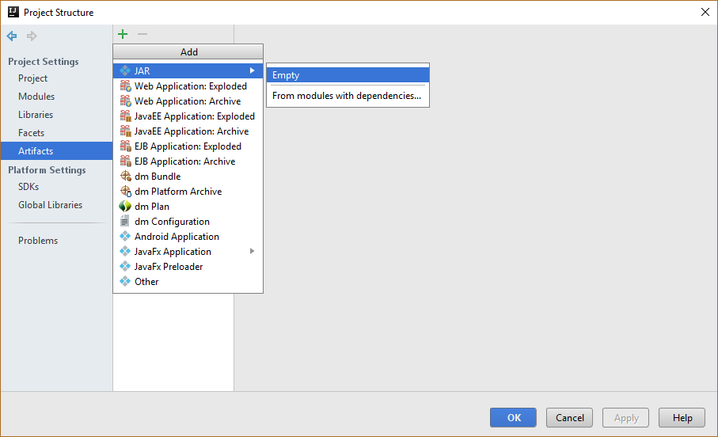

1. Name your artifact while making sure not to add the ".jar" extension, and then specify the target folder for the Maven output.

   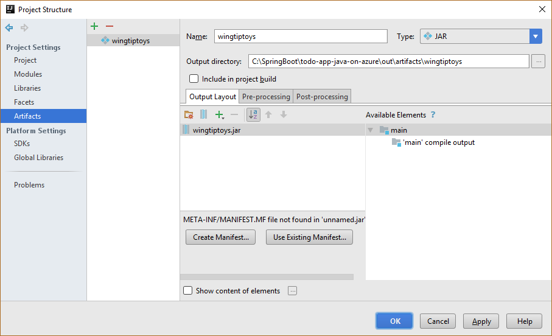

1. Click **OK** to close the **Project Structure** dialog box.

> [!NOTE]
> For more information about creating artifacts in IntelliJ, see [Configuring Artifacts](https://www.jetbrains.com/help/idea/2016.1/configuring-artifacts.html) on the JetBrains website.
>

## Add the Maven project and build the artifact for deployment

1. Click **View**, then **Tool Windows**, and then **Maven Projects**.

   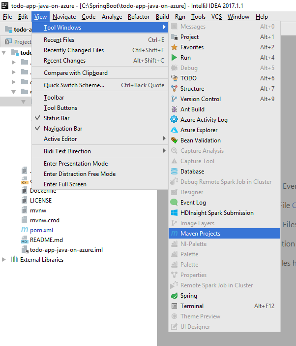

1. When the **Maven Projects** tool windows opens, click the green plus (**+**) symbol to add a project.

   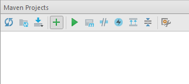

1. When the **Select Path** dialog box opens, navigate to the *pom.xml* file for your project, and then click **OK**.

   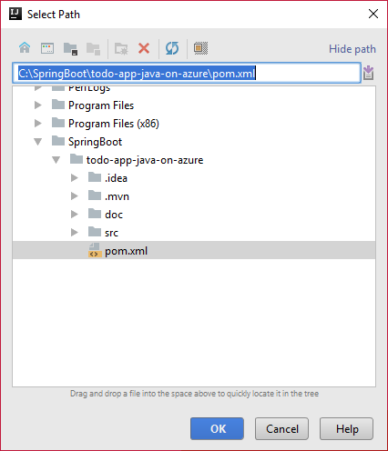

1. The **Maven Projects** tool window will display the Maven goals for your project.

   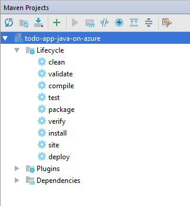

1. Click **Build**, and then click **Build Artifacts**.

   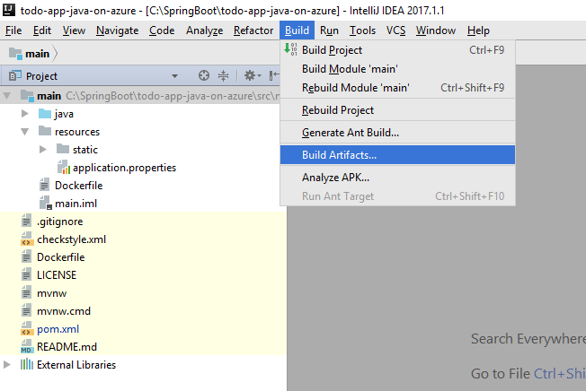

1. When the **Build Artifact** context menu appears, click **Build**.

   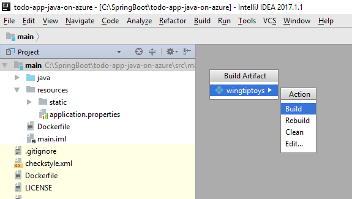

## Add Docker to the project and then deploy it to Azure

1. Add Docker support by right-clicking your project and selecting **Azure**, then **Add Docker Support**.

   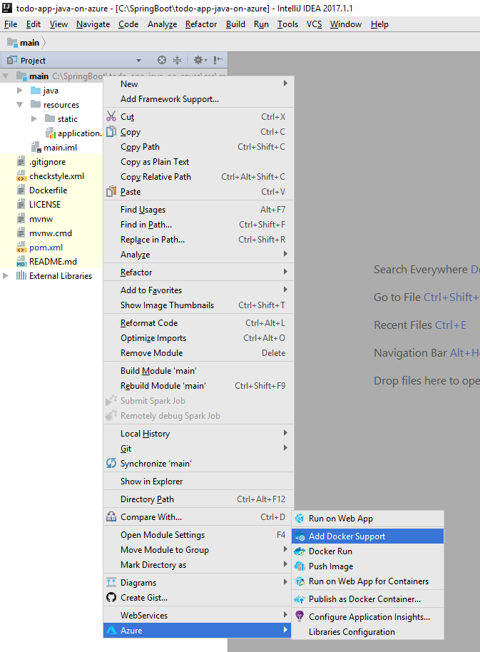

1. Deploy your app to Azure by right-clicking your project and selecting **Azure**, then **Run on Web App for Containers**.

   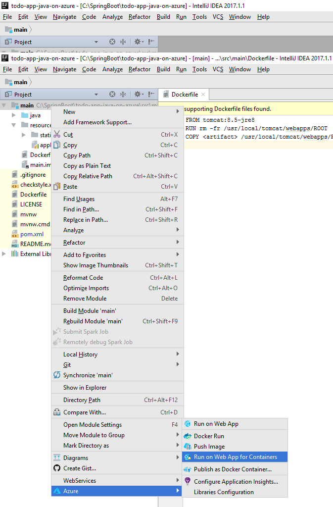

1. When the **Run on Web App for Containers** dialog box opens, select your container registry from earlier, specify the options for your web app, and then click **Run**.

   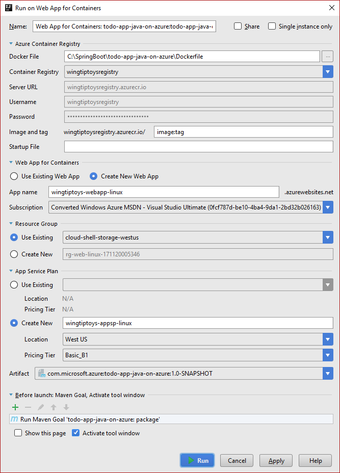

1. IntelliJ will display the deployment status 

   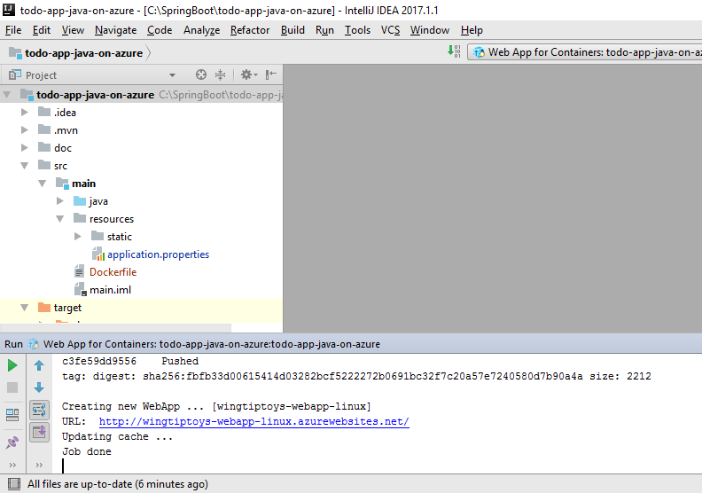

## Test the TODO sample application remotely

1. Browse to your web app's URL using a web browser; you should see same the home page for the sample app displayed.

   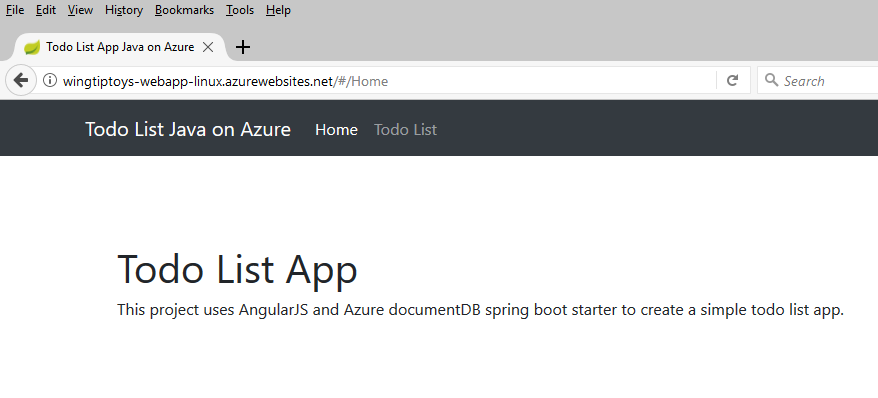

1. If you click on the **Todo List** link, you can Add/Edit/Remove entries from the todo list.

   

## OPTIONAL: Remove your resources from your Azure account

You can delete the web app that you created in this tutorial using the **Azure Explorer** in IntelliJ by right-clicking your web app, then clicking **Delete**.

   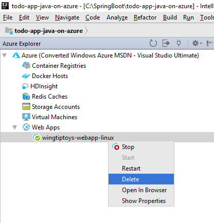

When prompted to confirm the deletion, click **Yes**.

## Summary

In this tutorial you learned how to clone a sample Spring Boot application that uses Cosmos DB for data and deploy it to Azure using IntelliJ.
